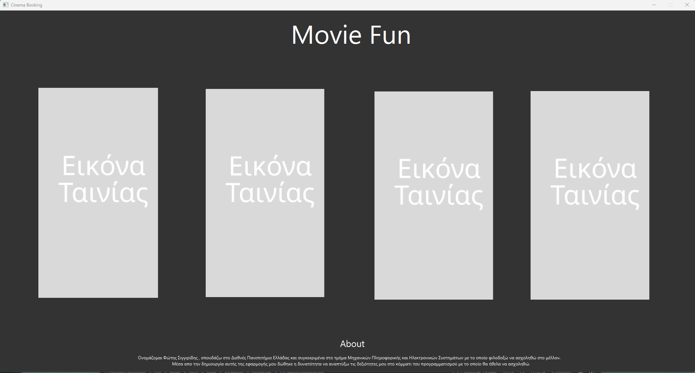
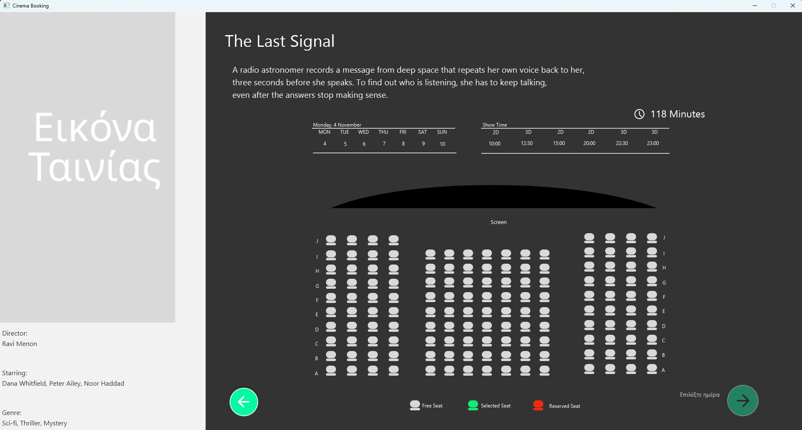
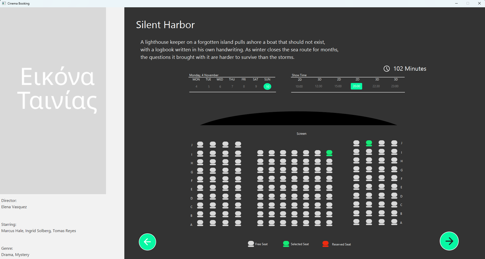
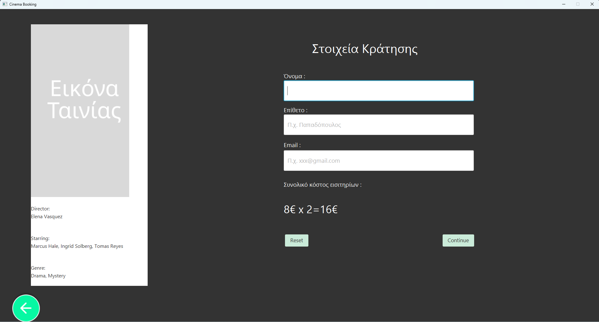

# Cinema Booking

A JavaFX desktop application for booking cinema tickets. The user picks a movie, a date and
a show time, selects seats from an interactive seat map, and fills in their details to
complete the reservation. Each movie page also shows a short description, the director,
the cast and the running time.

Built with **JavaFX** and **FXML**, with the application logic in the controller layer.

## Screenshots

| Movie selection | Nothing selected yet | Day, time and seat selected | Booking details |
|---|---|---|---|
|  |  |  |  |

## Features

- Choose a movie, a date, a show time and one or more seats
- Interactive seat map with three states: free, selected and reserved
- The continue button stays disabled until a day, a time and at least one seat are chosen,
  with an on-screen hint explaining what is still missing
- Automatic ticket cost calculation based on the number of selected seats
- Validation of the customer's first name, last name and email address
- Short description, director, cast and running time for every movie

## Tech stack

Java 23 · JavaFX 17 · FXML · CSS · Maven

## Running locally

Requirements: JDK 23 or newer.

```bash
mvnw.cmd clean javafx:run      # Windows
./mvnw clean javafx:run        # Linux / macOS
```

## Known limitations

- Reservations are not persisted: they are lost when the application closes
- There is no payment system; the ticket cost is only calculated and displayed
- Seats are defined statically in FXML instead of being generated at runtime
- The movies, the cast and the posters are fictional placeholders

## Author

This was a one-person university project.

- **[Fotis Singiridis](https://github.com/Fotis28)**